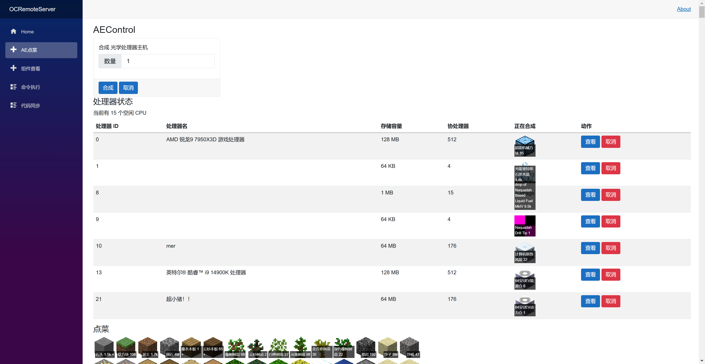
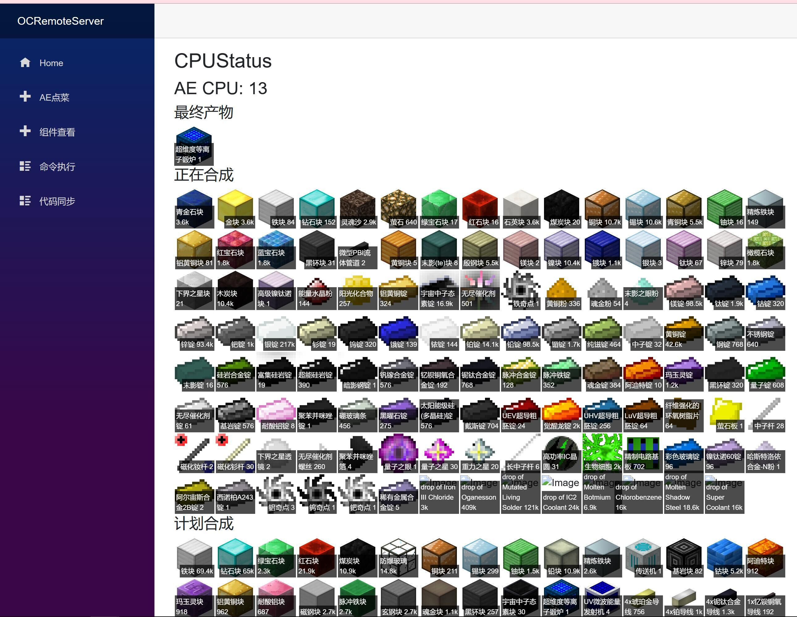
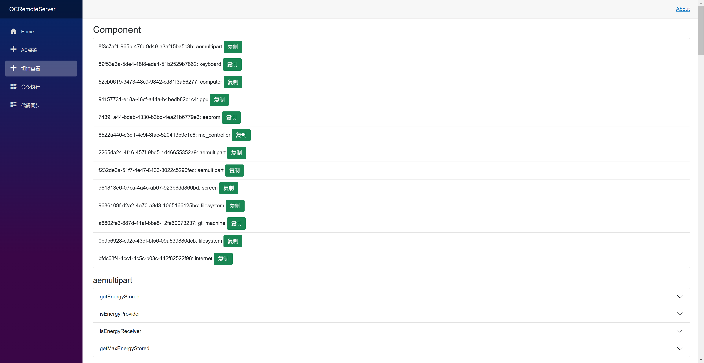

# OCRemote

> 我家转为无线能源时代，修改了能量输入的计算方法，这部分改动放到此分支，原分支已经不再维护，如果你家还没出无线能源的话可以尝试去搭建

我自己用的 GTNH [性能优化方案](docs/performance.md)

## 部署

任何搞不懂的都可以来问我，我可以语音+远程帮你，找 Cyl18

### 项目三个文件夹的介绍

- `OC` 为动态执行的 lua 脚本，你需要修改 energy_station.lua
- `OCServer` 为游戏内 OC 电脑需要执行的文件，你需要通过复制粘贴或者 wget 将其中的两个文件上传到游戏内
- `OCRemoteServer` 为与游戏内对接的 C# 端，你需要用 dotnet/vs/rider 运行它

### 安装教程

- 安装 rider 或 vs，.net 7 sdk
- 从 NEI 找到数据存储 导出物品面板 128*128png 在 `OCRemoteServer/Config.cs` 中路径改过去
- 如果 MC 服务端和运行此项目不是在同一台主机运行，你需要在 `OCServer/server2.lua` 修改 http 地址，如果你需要修改端口，可以在 `Programs.cs` 内修改
- 将 OCServer 下的文件 全部弄到游戏内，运行 OCServer
- 修改 OC 配置文件 `允许访问本地 ip，解除内存限制（或者使用魔法内存），CPU 加速（我不知道是否需要）`，本项目根目录带了一份可以用的 `OpenComputers.cfg`
- 去搞一个 blazorise token, 修改 Config.cs, token 直接找 Cyl18 要就行
- 反代然后运行

## Showcase

