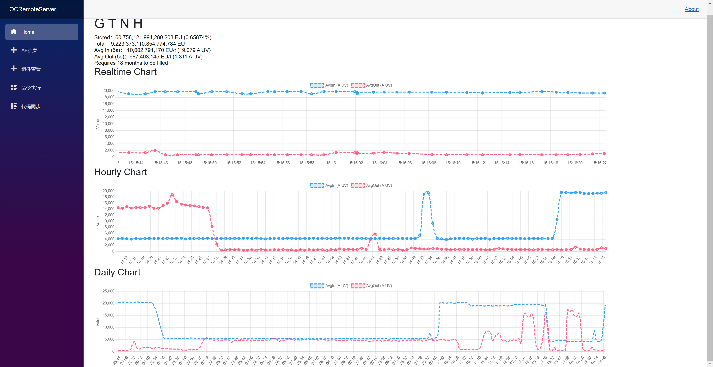

# OCRemote

> ***我家转为无线能源时代，修改了能量输入的计算方法，这部分改动放到另一条 git 分支***

我自己用的 GTNH [性能优化方案](docs/performance.md)

## 部署

- 安装 rider 或 vs，.net 7 sdk
- 从 NEI 找到数据存储 导出物品面板 128*128png 把 `Controller\AEController.cs` 中路径改过去
- OCServer/server2.lua 修改 http 地址
- OCServer 下的文件 全部弄到游戏内，运行 server2.lua
- 可以修改 oc 配置文件 允许访问本地 ip，解除内存限制（或者使用魔法内存），CPU 加速（我不知道是否需要），项目根目录有配置文件可以直接替换
- 去搞一个 blazorize token 运行根目录新建 blazorise.txt, token 直接找 Cyl18 要也行
- 运行 OCRemoteServer

## Showcase

